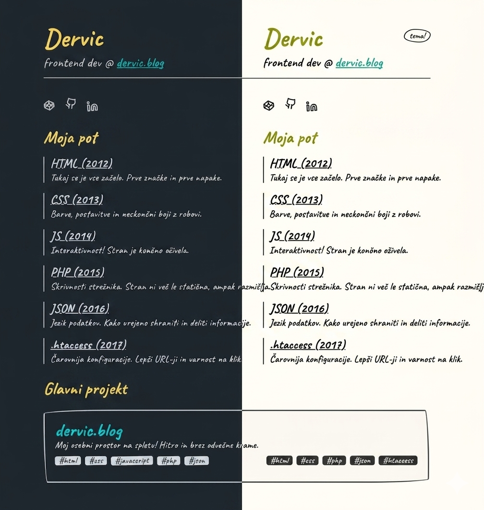

# Dervic Portfolio



Osebna spletna stran za predstavitev mojih projektov, veščin in izkušenj.

## 📖 O projektu
Ta portfolio je bil zasnovan za centralizirano predstavitev mojega dela, dosežkov in tehničnega znanja. Stran je čista, pregledna in uporabniku prijazna, kar obiskovalcem omogoča hiter vpogled v moje projekte.

## 🌐 Predogled v živo (Live Demo)
Spletno stran si lahko ogledate tukaj:
[https://dervicblog.github.io/Dervic-Porfolio/](https://dervicblog.github.io/Dervic-Porfolio/)

## 🚀 Glavne lastnosti
* **Responsive dizajn:** Optimizirano za vse naprave – od pametnih telefonov do namiznih računalnikov.
* **Zmogljivost:** Minimalistična koda za hitro nalaganje.
* **Predstavitev projektov:** Pregleden prikaz mojih spletnih projektov.

## 🛠️ Tehnologije
* HTML5
* CSS3
* JavaScript

## ⚙️ Lokalna namestitev
Za ogled projekta na vašem lokalnem računalniku:

1. Klonirajte repozitorij:
   ```bash
   git clone [https://github.com/dervicblog/Dervic-Porfolio.git](https://github.com/dervicblog/Dervic-Porfolio.git)

## 📬 Kontakt
Za vprašanja ali predloge me lahko kontaktirate preko e-pošte:
* info@dervic.blog

## ⚖️ Licenca
[© 2026 Dervic. Vse pravice pridržane.]
Ta projekt je avtorsko zaščiten. Razmnoževanje, distribucija, spreminjanje ali kakršna koli druga uporaba izvorne kode brez izrecnega pisnega dovoljenja avtorja je strogo prepovedana.

---


